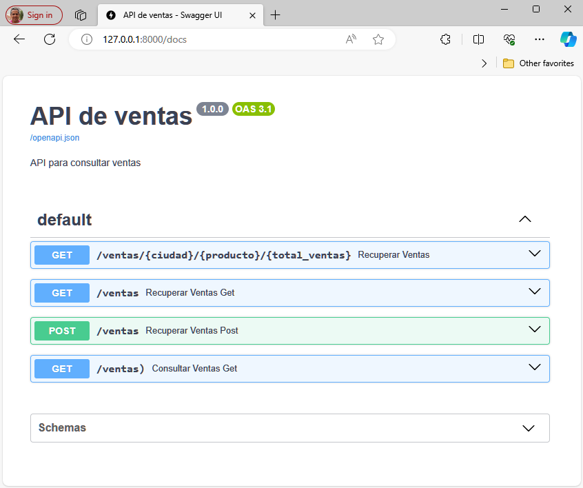

# API REST filtros avanzados

```powershell
pip install fastapi uvicorn httpx asynctest
```

## **Curls de pruebas**

Recuperar ventas Get
```powershell
curl --location --request GET 'http://localhost:8000/ventas' --header 'Content-Type: application/json' --header 'Accept: application/json' --data '{"ciudad": "*","producto": "Nissan", "total_ventas": ">9"}'
{"response":[{"id":1,"producto":"Nissan","ciudad":"Valencia","cantidad":10}]}
```
Recuperar ventas Post
```powershell
curl --location --request POST 'http://localhost:8000/ventas' --header 'Content-Type: application/json' --header 'Accept: application/json' --data '{"ciudad": "*","producto": "Nissan","total_ventas": ">9"}'
{"response":[{"id":1,"producto":"Nissan","ciudad":"Valencia","cantidad":10}]}
```
Recuperar Ventas
```powershell
 curl --location --request GET 'http://localhost:8000/ventas/*/Nissan/>9' --header 'Accept: application/json'
{"response":[{"id":1,"producto":"Nissan","ciudad":"Valencia","cantidad":10}]}
```
Consultar ventas get
```powershell
curl --location --request GET 'http://localhost:8000/ventas)?ciudad=Madrid&producto=*&total_ventas=%3E5' --header 'Accept: application/json'
{"response":[{"id":5,"producto":"Mazda","ciudad":"Madrid","cantidad":30}]}
```

## Open API del API Rest



Escenarios de prueba

```json
GET {{baseUrl}}/ventas)?ciudad=*=*&total_ventas=*
```

```json
GET {{baseUrl}}/ventas)?ciudad=Madrid&producto=*&total_ventas=>5
```

```json
GET {{baseUrl}}/ventas/*/Nissan/>9
```

```json
GET {{baseUrl}}/ventas/*/*/*
```

```json
GET {{baseUrl}}/ventas
Body:
{
    "ciudad": "*",
    "producto": "Mazda",
    "total_ventas": ">9"
}
```

```json
GET {{baseUrl}}/ventas
Body:
{
    "ciudad": "Barcelona",
    "producto": "*",
    "total_ventas": ">9"
}
```

``` json
POST {{baseUrl}}/ventas
Body:
{
    "ciudad": "*",
    "producto": "*",
    "total_ventas": ">24"
}
```

```json
POST {{baseUrl}}/ventas
Body:
{
    "ciudad": "Madrid",
    "producto": "*",
    "total_ventas": "<21"
}
```

## Pruebas unitarias

Prueba de métodos estándares y soportados en el marco directamente

```powershell
py -m unittest test_unittest
ventas_get_parametros_url->
.ventas_get_parametros_parametros_end_point->
.ventas_post->
.
----------------------------------------------------------------------
Ran 3 tests in 0.020s

OK
```

Prueba de métodos no estándar (Solicitudes GET con Body)

```powershell
py -m unittest test_asynctest
ventas_get_solicitud_body->
.
----------------------------------------------------------------------
Ran 1 test in 0.005s

OK
```


## Cliente Front-end

Hemos incluido un cliente `front-end` que utiliza el método `GET` con `body` como ejemplo de uso de la `APIRest` con una solicitud no estándar `APIRestFul`

En este caso y para facilidad con el código `javascript` en una posible renderización html; en el `front-end`se define como `POST` aunque consuma una solicitud a la APIRest `GET` con `Body`.

``` python
@app.post("/obtener_ventas")
async def obtener_ventas(query: QueryParams):
    # Hacer una solicitud GET al servidor FastAPI original
    url = "http://localhost:8000/ventas"
    data = {
        "ciudad": query.ciudad,
        "producto": query.producto,
        "total_ventas": query.total_ventas,
    }
    headers = {
        'Content-Type': 'application/json',
        'Accept': 'application/json',
    }

    try:
        async with httpx.AsyncClient() as client:
            response = await client.request('GET', url, data=json.dumps(data), headers=headers)
            response.raise_for_status()

        # Manejar la respuesta del servidor original
        return JSONResponse(content=response.json())
    except Exception as e:
        # Manejar otros tipos de excepciones
        raise HTTPException(status_code=500, detail=str(e))
```


> **NOTA:** Estas solicitudes `GET` con `Body` no son recomendables en el estandar `APIRestFul`
